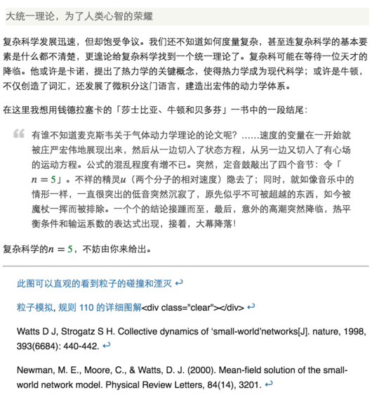

豆瓣markdown插件

如果你现在还有在豆瓣写文章，影评，书评的需求，而且更倾向于使用
markdown，那么这个插件可能会比较好的帮助你。

它读取对应位置的markdown内容，然后转换成html。安装完成后可以查看效果：https://book.douban.com/review/8007291/

安装参见[这里](https://greasyfork.org/zh-CN/scripts/21648/)
